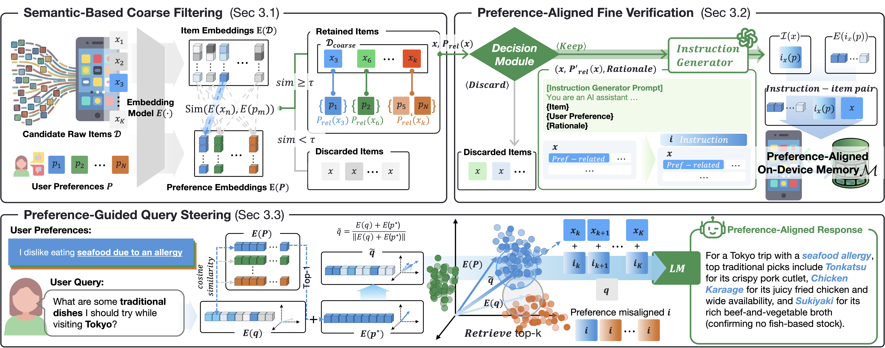

# From Volume to Value: Preference-Aligned Memory Construction for On-Device RAG

**Changmin Lee, Jaemin Kim, and Taesik Gong**

**ICML '26:** Proceedings of the 43rd International Conference on Machine Learning

### Motivation

<p align="center">
  
</p>

### Method

<p align="center">
  
</p>

---

## Installation

```bash
conda create -n epic python=3.10 -y
conda activate epic
pip install -r requirements.txt
pip install datasets   # required for LMSYS corpus collection
```

GPU with CUDA is recommended for embedding models and vLLM.

---

## Quick start

### 1. Prepare document corpora

All preprocessing artifacts are written to the **repository root** (where you run the scripts).

#### Wikipedia (`doc_mode=wiki`) — PrefWiki, PrefRQ

1. Download and extract Wikipedia (e.g. [Wikimedia dump](https://dumps.wikimedia.org/) + [WikiExtractor](https://github.com/attardi/wikiextractor)).
2. Sample documents:

```bash
python preprocess/sample_documents.py \
  --doc_type wiki \
  --input_dir /path/to/filtered_wiki_json \
  --sample_size 10000
# → sampled_wiki_doc_10000.jsonl
```

3. Chunk and embed:

```bash
python preprocess/build_chunks.py --doc_file sampled_wiki_doc_10000.jsonl
# → sampled_wiki_chunk_10000.jsonl

python preprocess/build_embeddings.py \
  --model_name facebook/contriever \
  --chunk_file sampled_wiki_chunk_10000.jsonl
# → sampled_wiki_embedding_facebook_contriever_10000.npy
```

#### ELI5 (`doc_mode=eli5`) — PrefELI5

1. Download [ELI5 supporting documents](https://github.com/facebookresearch/ELI5/tree/main/data_creation).
2. Sample:

```bash
python preprocess/sample_documents.py \
  --doc_type eli5 \
  --input_dir /path/to/eli5_repo \
  --sample_size 2000
# → sampled_eli5_doc_2000.jsonl
```

3. Chunk and embed:

```bash
python preprocess/build_chunks.py --doc_file sampled_eli5_doc_2000.jsonl
python preprocess/build_embeddings.py \
  --model_name facebook/contriever \
  --chunk_file sampled_eli5_chunk_2000.jsonl
```

#### LMSYS (`doc_mode=lmsys`) — PrefEval

```bash
cd dataset/creation/prefeval
python collect.py      # downloads lmsys/lmsys-chat-1m
python preprocess.py   # → lmsys_chat1m_conv_chunks_text.jsonl
cd ../../..
```

Sample 2,000 chunks into the format expected by `build_embeddings.py` (fields: `id`, `title`, `text`), save as `sampled_lmsys_doc_2000.jsonl` in the repo root, then:

```bash
python preprocess/build_chunks.py --doc_file sampled_lmsys_doc_2000.jsonl
python preprocess/build_embeddings.py \
  --model_name facebook/contriever \
  --chunk_file sampled_lmsys_chunk_2000.jsonl
```

---

### 2. Start the vLLM server (Llama 3.1 8B)

Edit `run_vllm_llama.sh` and set your Hugging Face token (required for gated Llama weights):

```bash
export HUGGINGFACE_TOKEN=hf_xxxxxxxxxxxxxxxx
```

Then launch:

```bash
bash run_vllm_llama.sh 0 8008
# Usage: bash run_vllm_llama.sh <GPU_IDS> <PORT>
# Example with 2 GPUs: bash run_vllm_llama.sh 0,1 8008
```

Other backends (optional):

```bash
bash run_vllm_qwen.sh 0 8008   # Qwen3-4B-Instruct
bash run_vllm_oss.sh 0 8008    # gpt-oss-20b
```

---

### 3. Run EPIC

Default settings: **Contriever** embeddings, **Llama-3.1-8B-Instruct** via vLLM on port **8008**.

**Single persona (PrefWiki, full pipeline):**

```bash
python EPIC_main.py \
  --method EPIC \
  --persona_index 0 \
  --device cuda:0 \
  --mode all \
  --output_dir output \
  --dataset PrefWiki \
  --emb_model_name facebook/contriever \
  --doc_mode wiki \
  --vllm_server_url 8008 \
  --llm_model_name meta-llama/Llama-3.1-8B-Instruct
```

**All personas:**

```bash
python EPIC_main.py \
  --method EPIC \
  --persona_index all \
  --device cuda:0 \
  --mode all \
  --output_dir output \
  --dataset PrefWiki \
  --emb_model_name facebook/contriever \
  --doc_mode wiki \
  --vllm_server_url 8008 \
  --llm_model_name meta-llama/Llama-3.1-8B-Instruct
```

**Other datasets** — change `--dataset` and `--doc_mode`:

```bash
# PrefELI5
python EPIC_main.py --method EPIC --persona_index all --mode all \
  --output_dir output --dataset PrefELI5 --doc_mode eli5 \
  --vllm_server_url 8008 --device cuda:0

# PrefRQ (wiki corpus)
python EPIC_main.py --method EPIC --persona_index all --mode all \
  --output_dir output --dataset PrefRQ --doc_mode wiki \
  --vllm_server_url 8008 --device cuda:0

# PrefEval (lmsys corpus)
python EPIC_main.py --method EPIC --persona_index all --mode all \
  --output_dir output --dataset PrefEval --doc_mode lmsys \
  --vllm_server_url 8008 --device cuda:0
```

Run stages separately with `--mode indexing`, `generation`, or `evaluation`.

| `--dataset` | `--doc_mode` | Personas (`--persona_index all`) |
|-------------|--------------|----------------------------------|
| `PrefWiki`  | `wiki`       | 0–56 (57)                        |
| `PrefRQ`    | `wiki`       | 0–89 (90)                        |
| `PrefELI5`  | `eli5`       | 0–72 (73)                        |
| `PrefEval`  | `lmsys`      | 0–56 (57)                        |

---

## Outputs

Results are written under paths like:

```
output_prefwiki/wiki/EPIC/<persona_index>/
  gen_EPIC_flat_<persona_index>.json
  eval_EPIC_flat_<persona_index>.json
```

Persona-level FAISS indices are stored under `data/indexing/<doc_mode>/EPIC_<dataset>/`.

Completed steps are skipped automatically if output files already exist.

---

## Repository structure

```
EPIC_main.py          # Entry point
EPIC_indexing.py      # Retrieval index construction
EPIC_generation.py    # LLM generation with retrieved context
EPIC_evaluation.py    # Preference-violation evaluation
EPIC_utils.py         # Shared utilities
preprocess/           # Corpus sampling, chunking, embeddings
dataset/              # Benchmark task JSON files
prompt/               # Prompt templates
run_vllm_*.sh         # vLLM launch scripts
assets/               # Figures
```

---

## Citation

<!-- TBD -->
